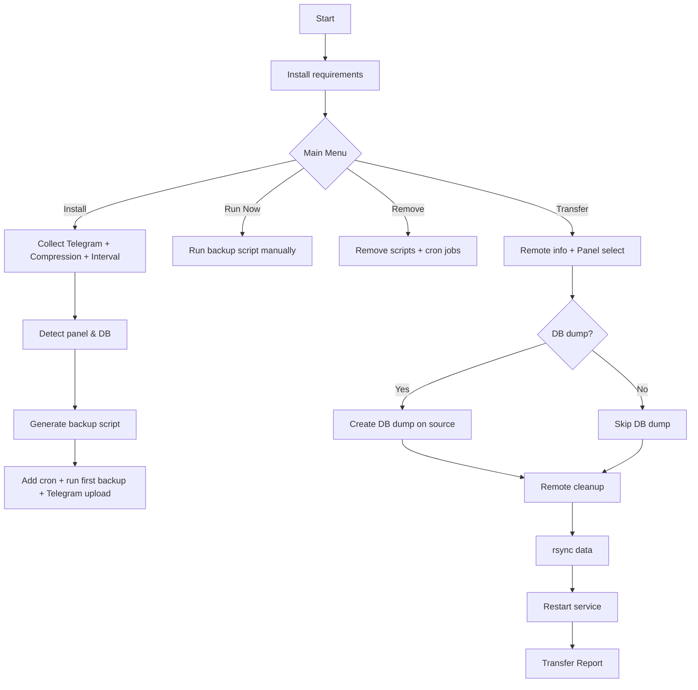

---

````md
# 🛡️ Backup_Pro — Time Backup & Transfer (Marzneshin / Marzban / Pasarguard / X-ui)

Interactive Bash tool for **scheduled backups**, **Telegram delivery**, and **server-to-server transfer** of supported VPN panels.

ابزار تعاملی Bash برای **بکاپ زمان‌بندی‌شده**، **ارسال به تلگرام** و **انتقال بین دو سرور** برای پنل‌های پشتیبانی‌شده.

---

## 🌐 Language | زبان
- 🇬🇧 [English](#-english)
- 🇮🇷 [فارسی](#-فارسی)

---

## 🚀 Quick Install | نصب سریع

```bash
sudo bash -c "$(curl -sL https://github.com/Mehrdad11228/Backup_Pro/raw/main/Backup-Transfor.sh)"
````

> ⚠️ Runs as **root** and installs required packages.

---

## ✅ Supported Panels | پنل‌های پشتیبانی‌شده

| Panel          | Backup Paths                                                                 | Transfer |                Database Dump |
| -------------- | ---------------------------------------------------------------------------- | -------: | ---------------------------: |
| **Marzban**    | `/opt/marzban`, `/var/lib/marzban`                                           |        ✅ |            ✅ (MySQL/MariaDB) |
| **Marzneshin** | `/etc/opt/marzneshin`, `/var/lib/marznode`, `/var/lib/marzneshin`            |        ✅ |            ✅ (MySQL/MariaDB) |
| **Pasarguard** | `/opt/pasarguard`, `/opt/pg-node`, `/var/lib/pasarguard`, `/var/lib/pg-node` |        ✅ | ✅ (MySQL/MariaDB/PostgreSQL) |
| **X-ui**       | `/etc/x-ui`, `/root/cert/`                                                   |        ✅ |                            — |

---

# 🇬🇧 English

## ✨ Overview

**Backup_Pro** is an interactive Bash utility for administrators who need:

* automated backups (with optional scheduling)
* compression in multiple formats
* Telegram delivery (backup file + report)
* server-to-server transfer (migration) using `rsync` over SSH

This project supports **Marzban**, **Marzneshin**, **Pasarguard**, and **X-ui**.

---

## 🔥 Main Features

### 1) Automated Backups

* Detects panel type and important directories automatically
* Optional database dump depending on the detected DB type:

  * SQLite → DB files already included in panel data paths
  * MySQL / MariaDB → `mysqldump`
  * PostgreSQL (Pasarguard) → `pg_dump` (via docker exec)
* Multiple compression formats: `zip`, `tgz`, `7z`, `tar`, `gzip/gz`
* Telegram upload with HTML report (date, panel, db type, size, etc.)

### 2) Scheduling via Cron

* Choose interval by **minutes** or **hours**
* Installs a cron job and runs the first backup immediately

### 3) Transfer (Migration) — Source → Destination

* Prompts for remote server info (IP/user/password)
* Optional: create DB dump on source before transfer
* Cleans destination folders, syncs data with `rsync`, then restarts panel service on the destination
* Prints a detailed **Transfer Report** on success or failure

> Note: Transfer uses `sshpass` (password-based SSH). For higher security, SSH key authentication is recommended.

---

## 🌲 Script Flow (Tree)

```text
Backup-Transfor.sh
├─ Initialization
│  ├─ Root check
│  └─ Install requirements
├─ Main Menu
│  ├─ [1] Install Backuper
│  │  ├─ Telegram token / chat_id
│  │  ├─ Compression type
│  │  ├─ Interval (minutes/hours)
│  │  ├─ Detect DB + generate backup script
│  │  └─ Add Cron + run first backup
│  ├─ [2] Remove Backuper
│  │  ├─ Remove scripts
│  │  └─ Remove cron entries
│  ├─ [3] Run Backup Now
│  │  └─ Run installed backup script manually
│  └─ [4] Transfer Backup
│     ├─ Select panel
│     ├─ Source pre-check (required paths)
│     ├─ Remote credentials
│     ├─ Optional DB dump on source
│     ├─ Remote cleanup
│     ├─ rsync folders + optional DB dump
│     └─ Restart service + Transfer Report
└─ End
```

---

## 🧩 Mermaid Diagram (GitHub Supported)



---

## 🛡️ Security Notes

* Runs as `root` and installs packages.
* Telegram credentials are stored inside generated backup scripts on the server.
* Password-based SSH transfer uses `sshpass`. Prefer SSH keys for production use.

---

# 🇮🇷 فارسی

## ✨ معرفی

**Backup_Pro** یک اسکریپت تعاملی Bash است برای مدیرانی که نیاز دارند:

* بکاپ خودکار (با امکان زمان‌بندی)
* فشرده‌سازی در فرمت‌های مختلف
* ارسال بکاپ به تلگرام همراه گزارش
* انتقال کامل داده‌ها از یک سرور به سرور دیگر (Migration) با `rsync` روی SSH

این پروژه از پنل‌های **Marzban**، **Marzneshin**، **Pasarguard** و **X-ui** پشتیبانی می‌کند.

---

## ✅ قابلیت‌ها

### ۱) بکاپ‌گیری خودکار

* تشخیص پنل و مسیرهای مهم به صورت خودکار
* بکاپ دیتابیس به صورت اختیاری و براساس نوع DB:

  * SQLite → فایل‌های دیتابیس داخل مسیرهای اصلی پنل قرار دارند
  * MySQL/MariaDB → با `mysqldump`
  * PostgreSQL (Pasarguard) → با `pg_dump` (از طریق docker exec)
* فشرده‌سازی: `zip`، `tgz`، `7z`، `tar`، `gzip/gz`
* ارسال به تلگرام همراه گزارش HTML (تاریخ، پنل، نوع DB، حجم و …)

### ۲) زمان‌بندی با Cron

* انتخاب بازه زمانی برحسب **دقیقه** یا **ساعت**
* ثبت cron job و اجرای اولین بکاپ بلافاصله پس از نصب

### ۳) انتقال (Migration) از سرور مبدا به مقصد

* دریافت IP/User/Password مقصد
* (اختیاری) ساخت DB Dump روی مبدا قبل از انتقال
* پاک‌سازی مسیرهای مقصد و همگام‌سازی با `rsync`
* ریستارت سرویس پنل روی مقصد
* نمایش گزارش کامل **Transfer Report** در حالت موفق/خطا

> نکته: انتقال با `sshpass` انجام می‌شود (ورود با پسورد). برای امنیت بالاتر، SSH Key توصیه می‌شود.

---

## 🌲 ساختار منطقی (درختی)

```text
Backup-Transfor.sh
├─ آماده‌سازی
│  ├─ بررسی دسترسی روت
│  └─ نصب پیش‌نیازها
├─ منوی اصلی
│  ├─ [1] نصب بکاپ‌گیر
│  │  ├─ دریافت Token/ChatID تلگرام
│  │  ├─ انتخاب نوع فشرده‌سازی
│  │  ├─ انتخاب بازه (دقیقه/ساعت)
│  │  ├─ تشخیص DB + ساخت اسکریپت بکاپ
│  │  └─ ثبت Cron + اجرای اولین بکاپ
│  ├─ [2] حذف بکاپ‌گیر
│  │  ├─ حذف اسکریپت‌ها
│  │  └─ حذف کران‌جاب‌ها
│  ├─ [3] اجرای دستی بکاپ
│  │  └─ اجرای اسکریپت بکاپ نصب‌شده
│  └─ [4] انتقال بکاپ
│     ├─ انتخاب پنل
│     ├─ پیش‌نیازهای مبدا (وجود مسیرها)
│     ├─ دریافت اطلاعات مقصد
│     ├─ (اختیاری) ساخت DB Dump روی مبدا
│     ├─ پاک‌سازی مقصد
│     ├─ انتقال با rsync + DB Dump (اختیاری)
│     └─ ریستارت سرویس + Transfer Report
└─ پایان
```

---

## 👨‍💻 Author

اگر خواستی، می‌تونم همین README رو **با Badgeها** (bash/telegram/rsync/license) و بخش **FAQ + Examples** هم کامل‌تر کنم.
```
